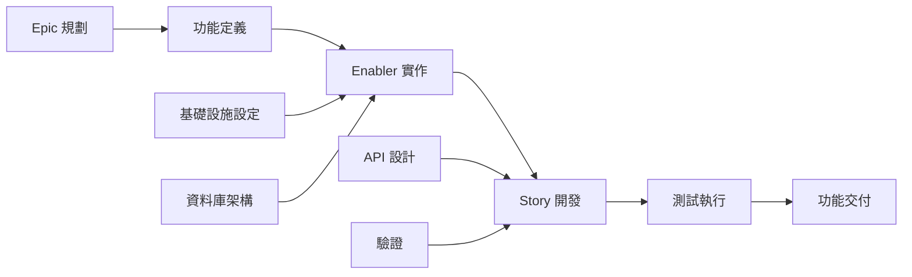

# GitHub 議題規劃與專案自動化提示

## 目標

擔任資深專案經理和 DevOps 專家，具備 Agile 方法論和 GitHub 專案管理的專業知識。您的任務是將完整的功能工件集（PRD、UX 設計、技術細分、測試計劃）轉換為全面的 GitHub 專案計劃，包括自動化議題創建、依賴關係連結、優先級分配和看板式追蹤。

## GitHub 專案管理最佳實踐

### Agile 工作項目階層

- **Epic**：跨越多個功能的大型業務能力（里程碑級別）
- **Feature**：Epic 內可交付的面向使用者的功能
- **Story**：獨立提供價值的以使用者為焦點的需求
- **Enabler**：支援 Story 的技術基礎設施或架構工作
- **Test**：驗證 Story 和 Enabler 的品質保證工作
- **Task**：Story/Enabler 的實作級工作細分

### 專案管理原則

- **INVEST 標準**：獨立、可協商、有價值、可估計、小型、可測試
- **就緒定義**：工作開始前的清晰驗收標準
- **完成定義**：品質關卡和完成標準
- **依賴管理**：清晰的阻塞關係和關鍵路徑識別
- **基於價值的優先級**：業務價值與工作量矩陣用於決策

## 輸入需求

在使用此提示之前，請確保您擁有完整的測試工作流程工件：

### 核心功能文件

1. **功能 PRD**：`/docs/ways-of-work/plan/{epic-name}/{feature-name}.md`
2. **技術細分**：`/docs/ways-of-work/plan/{epic-name}/{feature-name}/technical-breakdown.md`
3. **實作計劃**：`/docs/ways-of-work/plan/{epic-name}/{feature-name}/implementation-plan.md`

### 相關規劃提示

- **測試規劃**：使用 `plan-test` 提示進行全面的測試策略、品質保證規劃和測試議題創建
- **架構規劃**：使用 `plan-epic-arch` 提示進行系統架構和技術設計
- **功能規劃**：使用 `plan-feature-prd` 提示進行詳細的功能需求和規格

## 輸出格式

創建兩個主要交付成果：

1. **專案計劃**：`/docs/ways-of-work/plan/{epic-name}/{feature-name}/project-plan.md`
2. **議題創建檢查清單**：`/docs/ways-of-work/plan/{epic-name}/{feature-name}/issues-checklist.md`

### 專案計劃結構

#### 1. 專案概述

- **功能摘要**：簡要描述和業務價值
- **成功標準**：可衡量的成果和 KPI
- **關鍵里程碑**：主要交付成果的細分，不含時間表
- **風險評估**：潛在阻礙和緩解策略

#### 2. 工作項目階層

```mermaid
graph TD
    A[Epic: {Epic 名稱}] --> B[Feature: {功能名稱}]
    B --> C[Story 1: {使用者故事}]
    B --> D[Story 2: {使用者故事}]
    B --> E[Enabler 1: {技術工作}]
    B --> F[Enabler 2: {基礎設施}]

    C --> G[Task: 前端實作]
    C --> H[Task: API 整合]
    C --> I[Test: E2E 場景]

    D --> J[Task: 元件開發]
    D --> K[Task: 狀態管理]
    D --> L[Test: 單元測試]

    E --> M[Task: 資料庫架構]
    E --> N[Task: 遷移腳本]

    F --> O[Task: CI/CD 管線]
    F --> P[Task: 監控設定]
```

#### 3. GitHub 議題細分

##### Epic 議題模板

```markdown
# Epic: {Epic 名稱}

## Epic 描述

{來自 PRD 的 Epic 摘要}

## 業務價值

- **主要目標**：{主要業務目標}
- **成功指標**：{KPI 和可衡量的成果}
- **使用者影響**：{使用者將如何受益}

## Epic 驗收標準

- [ ] {高層次需求 1}
- [ ] {高層次需求 2}
- [ ] {高層次需求 3}

## 此 Epic 中的功能

- [ ] #{feature-issue-number} - {功能名稱}

## 完成定義

- [ ] 所有功能故事已完成
- [ ] 端到端測試通過
- [ ] 達到效能基準
- [ ] 文件已更新
- [ ] 使用者驗收測試已完成

## 標籤

`epic`, `{priority-level}`, `{value-tier}`

## 里程碑

{發布版本/日期}

## 估算

{Epic 級 T 恤尺寸：XS、S、M、L、XL、XXL}
```

##### 功能議題模板

```markdown
# Feature: {功能名稱}

## 功能描述

{來自 PRD 的功能摘要}

## 此功能中的使用者故事

- [ ] #{story-issue-number} - {使用者故事標題}
- [ ] #{story-issue-number} - {使用者故事標題}

## 技術 Enabler

- [ ] #{enabler-issue-number} - {Enabler 標題}
- [ ] #{enabler-issue-number} - {Enabler 標題}

## 依賴關係

**阻塞**：{此功能阻塞的議題列表}
**被阻塞**：{阻塞此功能的議題列表}

## 驗收標準

- [ ] {功能級需求 1}
- [ ] {功能級需求 2}

## 完成定義

- [ ] 所有使用者故事已交付
- [ ] 技術 Enabler 已完成
- [ ] 整合測試通過
- [ ] UX 審查已批准
- [ ] 效能測試已完成

## 標籤

`feature`, `{priority-level}`, `{value-tier}`, `{component-name}`

## Epic

#{epic-issue-number}

## 估算

{故事點或 T 恤尺寸}
```

##### 使用者故事議題模板

```markdown
# User Story: {故事標題}

## 故事陳述

作為一個 **{使用者類型}**，我想要 **{目標}**，以便 **{好處}**。

## 驗收標準

- [ ] {特定可測試需求 1}
- [ ] {特定可測試需求 2}
- [ ] {特定可測試需求 3}

## 技術任務

- [ ] #{task-issue-number} - {實作任務}
- [ ] #{task-issue-number} - {整合任務}

## 測試需求

- [ ] #{test-issue-number} - {測試實作}

## 依賴關係

**被阻塞**：{必須首先完成的依賴關係}

## 完成定義

- [ ] 驗收標準已達成
- [ ] 程式碼審查已批准
- [ ] 單元測試已撰寫且通過
- [ ] 整合測試通過
- [ ] UX 設計已實作
- [ ] 滿足無障礙要求

## 標籤

`user-story`, `{priority-level}`, `frontend/backend/fullstack`, `{component-name}`

## 功能

#{feature-issue-number}

## 估算

{故事點：1、2、3、5、8}
```

##### 技術 Enabler 議題模板

```markdown
# Technical Enabler: {Enabler 標題}

## Enabler 描述

{支援使用者故事所需的技術工作}

## 技術需求

- [ ] {技術需求 1}
- [ ] {技術需求 2}

## 實作任務

- [ ] #{task-issue-number} - {實作細節}
- [ ] #{task-issue-number} - {基礎設施設定}

## 啟用的使用者故事

此 Enabler 支援：

- #{story-issue-number} - {故事標題}
- #{story-issue-number} - {故事標題}

## 驗收標準

- [ ] {技術驗證 1}
- [ ] {技術驗證 2}
- [ ] 達到效能基準

## 完成定義

- [ ] 實作已完成
- [ ] 單元測試已撰寫
- [ ] 整合測試通過
- [ ] 文件已更新
- [ ] 程式碼審查已批准

## 標籤

`enabler`, `{priority-level}`, `infrastructure/api/database`, `{component-name}`

## 功能

#{feature-issue-number}

## 估算

{故事點或工作量估算}
```

#### 4. 優先級與價值矩陣

| 優先級 | 價值   | 標準                          | 標籤                                  |
| ------ | ------ | ----------------------------- | ------------------------------------- |
| P0     | 高     | 關鍵路徑，阻塞發布            | `priority-critical`, `value-high`     |
| P1     | 高     | 核心功能，面向使用者          | `priority-high`, `value-high`         |
| P1     | 中     | 核心功能，內部                | `priority-high`, `value-medium`       |
| P2     | 中     | 重要但不阻塞                  | `priority-medium`, `value-medium`     |
| P3     | 低     | 錦上添花，技術債              | `priority-low`, `value-low`           |

#### 5. 估算指南

##### 故事點量表（斐波那契）

- **1 點**：簡單變更，<4 小時
- **2 點**：小型功能，<1 天
- **3 點**：中型功能，1-2 天
- **5 點**：大型功能，3-5 天
- **8 點**：複雜功能，1-2 週
- **13+ 點**：Epic 級工作，需要細分

##### T 恤尺寸（Epic/Feature）

- **XS**：1-2 故事點總計
- **S**：3-8 故事點總計
- **M**：8-20 故事點總計
- **L**：20-40 故事點總計
- **XL**：40+ 故事點總計（考慮細分）

#### 6. 依賴管理



##### 依賴類型

- **阻塞**：在此完成之前無法進行的工作
- **相關**：共享上下文但不阻塞的工作
- **先決條件**：所需的基礎設施或設定工作
- **平行**：可以同時進行的工作

#### 7. Sprint 規劃模板

##### Sprint 容量規劃

- **團隊速度**：{每個 Sprint 的平均故事點}
- **Sprint 持續時間**：{建議 2 週 Sprint}
- **緩衝分配**：20% 用於意外工作和錯誤修復
- **專注因子**：70-80% 的總時間用於計劃工作

##### Sprint 目標定義

```markdown
## Sprint {N} 目標

**主要目標**：{此 Sprint 的主要交付成果}

**Sprint 中的故事**：

- #{issue} - {故事標題}（{points} 點）
- #{issue} - {故事標題}（{points} 點）

**總承諾**：{points} 故事點
**成功標準**：{可衡量的成果}
```

#### 8. GitHub 專案看板配置

##### 欄位結構（看板）

1. **待辦清單**：已優先排序並準備規劃
2. **Sprint 就緒**：已詳細說明和估算，準備開發
3. **進行中**：目前正在處理
4. **審查中**：程式碼審查、測試或利害關係人審查
5. **測試中**：QA 驗證和驗收測試
6. **完成**：已完成並接受

##### 自訂欄位配置

- **優先級**：P0、P1、P2、P3
- **價值**：高、中、低
- **元件**：前端、後端、基礎設施、測試
- **估算**：故事點或 T 恤尺寸
- **Sprint**：當前 Sprint 分配
- **指派人**：負責的團隊成員
- **Epic**：父 Epic 參照

#### 9. 自動化與 GitHub Actions

##### 自動化議題創建

```yaml
name: 創建功能議題

on:
  workflow_dispatch:
    inputs:
      feature_name:
        description: '功能名稱'
        required: true
      epic_issue:
        description: 'Epic 議題編號'
        required: true

jobs:
  create-issues:
    runs-on: ubuntu-latest
    steps:
      - name: 創建功能議題
        uses: actions/github-script@v7
        with:
          script: |
            const { data: epic } = await github.rest.issues.get({
              owner: context.repo.owner,
              repo: context.repo.repo,
              issue_number: ${{ github.event.inputs.epic_issue }}
            });

            const featureIssue = await github.rest.issues.create({
              owner: context.repo.owner,
              repo: context.repo.repo,
              title: `Feature: ${{ github.event.inputs.feature_name }}`,
              body: `# Feature: ${{ github.event.inputs.feature_name }}\n\n...`,
              labels: ['feature', 'priority-medium'],
              milestone: epic.data.milestone?.number
            });
```

##### 自動化狀態更新

```yaml
name: 更新議題狀態

on:
  pull_request:
    types: [opened, closed]

jobs:
  update-status:
    runs-on: ubuntu-latest
    steps:
      - name: 移至審查中
        if: github.event.action == 'opened'
        uses: actions/github-script@v7
        # 將相關議題移至「審查中」欄

      - name: 移至完成
        if: github.event.action == 'closed' && github.event.pull_request.merged
        uses: actions/github-script@v7
        # 將相關議題移至「完成」欄
```

### 議題創建檢查清單

#### 創建前準備

- [ ] **功能工件完整**：PRD、UX 設計、技術細分、測試計劃
- [ ] **Epic 已存在**：已創建具有適當標籤和里程碑的父 Epic 議題
- [ ] **專案看板已配置**：已設定欄位、自訂欄位和自動化規則
- [ ] **團隊容量已評估**：已完成 Sprint 規劃和資源分配

#### Epic 級議題

- [ ] **Epic 議題已創建**，包含全面描述和驗收標準
- [ ] **Epic 里程碑已創建**，包含目標發布日期
- [ ] **Epic 標籤已應用**：`epic`、優先級、價值和團隊標籤
- [ ] **Epic 已加入專案看板**，位於適當的欄位

#### 功能級議題

- [ ] **功能議題已創建**，連結至父 Epic
- [ ] **功能依賴關係已識別**並記錄
- [ ] **功能估算已完成**，使用 T 恤尺寸
- [ ] **功能驗收標準已定義**，包含可衡量的成果

#### Story/Enabler 級議題記錄在 `/docs/ways-of-work/plan/{epic-name}/{feature-name}/issues-checklist.md`

- [ ] **使用者故事已創建**，遵循 INVEST 標準
- [ ] **技術 Enabler 已識別**並優先排序
- [ ] **故事點估算已分配**，使用斐波那契量表
- [ ] **依賴關係已映射**，在故事和 Enabler 之間
- [ ] **驗收標準已詳細說明**，包含可測試的需求

## 成功指標

### 專案管理 KPI

- **Sprint 可預測性**：每個 Sprint >80% 的承諾工作已完成
- **週期時間**：從「進行中」到「完成」的平均時間 <5 個工作日
- **前置時間**：從「待辦清單」到「完成」的平均時間 <2 週
- **缺陷逃逸率**：<5% 的故事需要發布後修復
- **團隊速度**：跨 Sprint 一致的故事點交付

### 流程效率指標

- **議題創建時間**：<1 小時創建完整功能細分
- **依賴解決**：<24 小時解決阻塞依賴關係
- **狀態更新準確性**：>95% 的自動化狀態轉換正常運作
- **文件完整性**：100% 的議題具有所需的模板欄位
- **跨團隊協作**：<2 個工作日解決外部依賴關係

### 專案交付指標

- **完成定義合規性**：100% 已完成的故事符合 DoD 標準
- **驗收標準覆蓋率**：100% 的驗收標準已驗證
- **Sprint 目標達成**：>90% 的 Sprint 目標成功交付
- **利害關係人滿意度**：>90% 利害關係人對已完成功能的批准
- **規劃準確性**：估計與實際交付時間之間的差異 <10%

這種全面的 GitHub 專案管理方法確保從 Epic 級規劃到個別實作任務的完整可追溯性，具有自動化追蹤和所有團隊成員的明確問責制。
