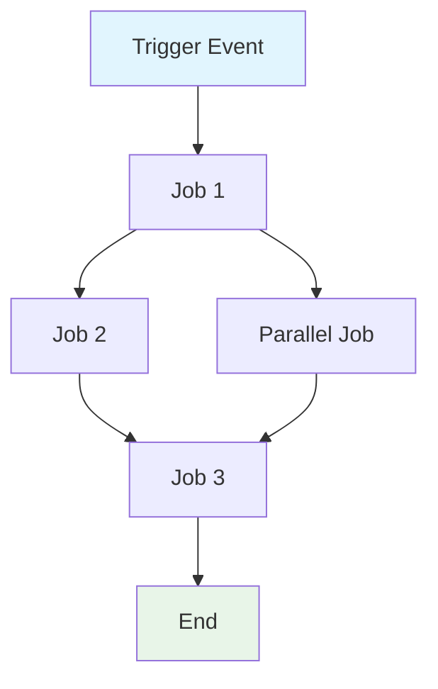
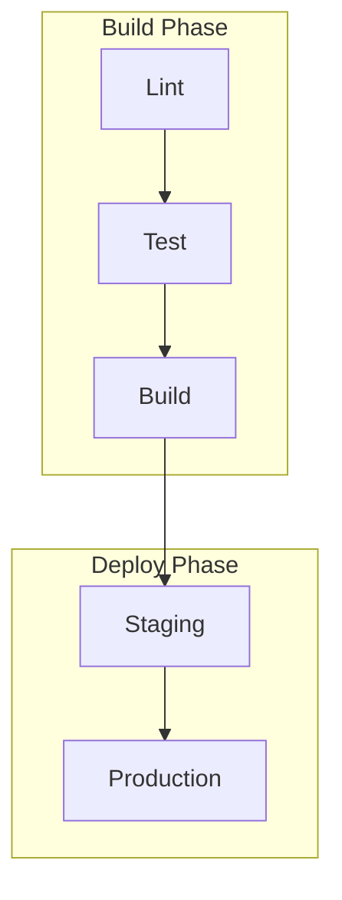

# 建立 GitHub Actions 工作流程規格說明書

為 GitHub Actions 工作流程建立完整規格說明書：`${input:WorkflowFile}`。

此規格說明書用於記錄工作流程的行為、需求和限制。規格說明必須與實作無關，著重於工作流程**達成什麼目標**而非**如何**實作。

## AI 最佳化需求

- **Token 效率**：使用簡潔的語言而不犧牲清晰度
- **結構化資料**：利用表格、清單和圖表來呈現密集資訊
- **語意清晰**：全文一致地使用精確的術語
- **實作抽象化**：避免特定的語法、指令或工具版本
- **可維護性**：設計以便工作流程演進時易於更新

## 規格說明範本

另存為：`/spec/spec-process-cicd-[workflow-name].md`

```md
---
title: CI/CD Workflow Specification - [Workflow Name]
version: 1.0
date_created: [YYYY-MM-DD]
last_updated: [YYYY-MM-DD]
owner: DevOps Team
tags: [process, cicd, github-actions, automation, [domain-specific-tags]]
---

## 工作流程概述

**用途**：[一句話描述工作流程的主要目標]
**觸發事件**：[列出觸發條件]
**目標環境**：[環境範圍]

## 執行流程圖



## 工作與相依性

| 工作名稱 | 用途 | 相依性 | 執行環境 |
|----------|---------|--------------|-------------------|
| job-1 | [用途] | [前置條件] | [Runner/環境] |
| job-2 | [用途] | job-1 | [Runner/環境] |

## 需求矩陣

### 功能需求
| ID | 需求 | 優先度 | 驗收準則 |
|----|-------------|----------|-------------------|
| REQ-001 | [需求] | 高 | [可測試的準則] |
| REQ-002 | [需求] | 中 | [可測試的準則] |

### 安全需求
| ID | 需求 | 實作限制 |
|----|-------------|---------------------------|
| SEC-001 | [安全需求] | [限制說明] |

### 效能需求
| ID | 指標 | 目標 | 測量方法 |
|----|-------|--------|-------------------|
| PERF-001 | [指標] | [目標值] | [如何測量] |

## 輸入/輸出合約

### 輸入

```yaml
# 環境變數
ENV_VAR_1: string  # 用途：[說明]
ENV_VAR_2: secret  # 用途：[說明]

# Repository 觸發器
paths: [路徑篩選清單]
branches: [分支模式清單]
```

### 輸出

```yaml
# 工作輸出
job_1_output: string  # 說明：[用途]
build_artifact: file  # 說明：[內容類型]
```

### 機密與變數

| 類型 | 名稱 | 用途 | 範圍 |
|------|------|---------|-------|
| Secret | SECRET_1 | [用途] | Workflow |
| Variable | VAR_1 | [用途] | Repository |

## 執行限制

### 執行時限制

- **逾時**：[最大執行時間]
- **並行執行**：[平行執行限制]
- **資源限制**：[記憶體/CPU 限制]

### 環境限制

- **Runner 需求**：[OS/硬體需求]
- **網路存取**：[外部連線需求]
- **權限**：[所需存取等級]

## 錯誤處理策略

| 錯誤類型 | 回應 | 恢復步驟 |
|------------|----------|-----------------|
| 構建失敗 | [回應] | [恢復步驟] |
| 測試失敗 | [回應] | [恢復步驟] |
| 部署失敗 | [回應] | [恢復步驟] |

## 品質關卡

### 關卡定義

| 關卡 | 準則 | 略過條件 |
|------|----------|-------------------|
| 程式碼品質 | [標準] | [允許的條件] |
| 安全掃描 | [閾值] | [允許的條件] |
| 測試涵蓋率 | [百分比] | [允許的條件] |

## 監測與可觀測性

### 關鍵指標

- **成功率**：[目標百分比]
- **執行時間**：[目標期間]
- **資源使用**：[監測方式]

### 警報

| 條件 | 嚴重度 | 通知目標 |
|-----------|----------|-------------------|
| [條件] | [等級] | [對象/位置] |

## 整合點

### 外部系統

| 系統 | 整合類型 | 資料交換 | SLA 需求 |
|--------|------------------|---------------|------------------|
| [系統] | [類型] | [資料格式] | [需求] |

### 相依工作流程

| 工作流程 | 關係 | 觸發機制 |
|----------|--------------|-------------------|
| [工作流程] | [類型] | [如何觸發] |

## 合規與治理

### 稽核需求

- **執行日誌**：[保留政策]
- **核准關卡**：[所需核准]
- **變更控制**：[更新流程]

### 安全控制

- **存取控制**：[權限模型]
- **機密管理**：[輪換政策]
- **弱點掃描**：[掃描頻率]

## 邊界情況與例外

### 情境矩陣

| 情境 | 預期行為 | 驗證方法 |
|----------|-------------------|-------------------|
| [邊界情況] | [行為] | [如何驗證] |

## 驗證準則

### 工作流程驗證

- **VLD-001**：[驗證規則]
- **VLD-002**：[驗證規則]

### 效能基準

- **PERF-001**：[基準準則]
- **PERF-002**：[基準準則]

## 變更管理

### 更新流程

1. **規格說明更新**：先修改此文件
2. **審查與核准**：[核准流程]
3. **實作**：將變更套用至工作流程
4. **測試**：[驗證方式]
5. **部署**：[發行流程]

### 版本歷程

| 版本 | 日期 | 變更 | 作者 |
|---------|------|---------|--------|
| 1.0 | [日期] | 初始規格說明 | [作者] |

## 相關規格說明

- [相關工作流程規格說明的連結]
- [基礎設施規格說明的連結]
- [部署規格說明的連結]

```

## 分析說明

分析工作流程檔案時：

1. **萃取核心目的**：識別主要商業目標
2. **對映工作流**：建立顯示執行順序的相依性圖表
3. **識別合約**：記錄輸入、輸出和介面
4. **擷取限制**：提取逾時、權限和限制
5. **定義品質關卡**：識別驗證和核准點
6. **記錄錯誤路徑**：對映失敗情境和恢復方式
7. **抽象實作**：著重於行為而非語法

## Mermaid 圖表指南

### 流程類型
- **順序性**：`A --> B --> C`
- **平行**：`A --> B & A --> C; B --> D & C --> D`
- **條件式**：`A --> B{Decision}; B -->|Yes| C; B -->|No| D`

### 樣式
```mermaid
style TriggerNode fill:#e1f5fe
style SuccessNode fill:#e8f5e8
style FailureNode fill:#ffebee
style ProcessNode fill:#f3e5f5
```

### 複雜工作流程
針對有 5 個以上工作的工作流程，使用子圖：


## Token 最佳化策略

1. **使用表格**：結構化格式中的密集資訊
2. **一致地縮寫**：定義一次，全文使用
3. **項目符號**：避免散文段落
4. **程式碼區塊**：結構化資料而非敘述
5. **交叉參考**：連結而非重複資訊

著重於建立既作為文件又可作為工作流程更新範本的規格說明。
